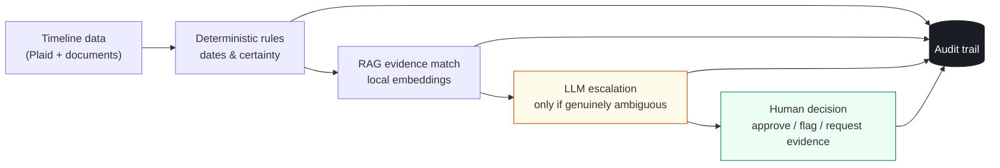

<div align="center">

# Tessel

**An evidence and explainability layer for underwriting — not another risk score.**

[](LICENSE)
[](https://www.python.org/)
[](https://fastapi.tiangolo.com/)
[](#roadmap)

</div>

Tessel takes a connected life transition — a change in status, income, or documentation that
plays out over months — and turns it into a traceable answer to one question:

> **What happened, what evidence supports it, what's still unresolved, and what would resolve it?**

Every conclusion links back to the exact deterministic check, retrieval match, LLM call, or
human decision that produced it. Nothing is a number you have to trust — everything is a claim
you can click through to verify.

## The problem

Lenders typically evaluate financial signals in isolation — an income gap here, an incoming
transfer there, a status change somewhere else — each scored independently, with no model of
how they connect. Someone whose income paused because of a documented, time-boxed, authorized
interruption looks identical to someone whose income just stopped, unless the system can
connect the two facts and check whether the connection actually holds up against evidence.

**Tessel connects them, and shows its work.**

## How it works



Four stages, escalating in cost only when they need to — most cases never reach the LLM at all:

| Stage | What it does |
|---|---|
| **1. Deterministic rules** | Do a gap's dates align with a documented authorized interruption? Did a transfer land inside it? Pure date/amount logic — no model, no ambiguity, resolves most cases outright. |
| **2. RAG evidence match** | Local `sentence-transformers` embeddings check whether a document's content actually supports the claim it's attached to. A keyword pass catches clear contradictions before similarity scoring even runs. |
| **3. LLM escalation** | Only for what's left genuinely ambiguous. Claude sees the exact structured records involved and is forced through a single schema-constrained tool call — no free text, no facts beyond what the rules already surfaced. |
| **4. Audit trail** | Every rule check, retrieval match, LLM call, and human decision is written as an append-only, timestamped entry, linked to what it evaluated. Nothing is edited after the fact. |

## The MVP: F-1 → OPT

The first proven instance of this pattern is the F-1 student → OPT work-authorization
transition:

- **Authorized-interruption alignment** — does an income gap's timing match a documented,
  evidence-backed pending work-authorization status?
- **Remittance plausibility** — did an international transfer arrive during that gap in a
  pattern consistent with family support while income paused?

F-1/OPT is the proof case, not an assumption baked into the schema. The category the rule
engine reasons over — `AUTHORIZED_INTERRUPTION` — is generic by design, so a different
interruption (parental leave, a severance period, a contractor transition) is a new entry in
that category, not a rewrite.

## Stack

| Layer | Tech | Why |
|---|---|---|
| API + data model | FastAPI + SQLAlchemy/SQLite | Typed, simple, zero infra for a prototype |
| Bank data | Plaid (Sandbox) | Real transaction data, not fabricated income events |
| Evidence matching | `sentence-transformers` (`all-MiniLM-L6-v2`) | Local, free, plenty accurate for document-vs-claim similarity |
| Ambiguous-case reasoning | Claude API, forced tool use | Structured, auditable output — never free-text judgment |
| UI | Server-rendered Jinja2 | One evidence-trail page and a case queue; no SPA overhead yet |

## Quickstart

```bash
python3 -m venv .venv && source .venv/bin/activate
pip install -r requirements.txt
```

<details>
<summary><strong>Set up your <code>.env</code></strong></summary>

```
PLAID_CLIENT_ID=your_client_id
PLAID_SECRET=your_sandbox_secret
PLAID_ENV=sandbox
ANTHROPIC_API_KEY=your_key          # optional — omit to see the graceful-fallback path instead
```

Needs a free [Plaid Sandbox](https://dashboard.plaid.com) account. The Anthropic key is only
needed to see real LLM escalation reasoning instead of the fallback message.
</details>

Seed one demo applicant end-to-end against real services — Plaid ingestion, RAG match, rule
engine, LLM escalation:

```bash
python scripts/seed_demo_applicant.py
```

Run it:

```bash
uvicorn app.main:app --reload
```

- **`localhost:8000/`** → case queue
- **`localhost:8000/applicants/1/evidence-trail`** → the seeded demo case

## Roadmap

**Coming soon:**

- [ ] Applicant-facing document upload — drag-and-drop, with live feedback as the RAG layer
      matches it against the milestone it's meant to support
- [ ] One-click PDF / shareable export of the evidence trail for compliance and audit handoff
- [ ] Continuous monitoring via Plaid's `SYNC_UPDATES_AVAILABLE` webhook, so a case updates
      itself as new transactions land instead of needing a manual re-run

**Where this could go:**

- [ ] A second proven interruption type (parental leave or a layoff/severance window) to prove
      out the generic schema against a scenario it wasn't designed around
- [ ] Portfolio-level view — coverage and resolution-rate metrics across every case, not risk
      scores, just "how much of this book is evidence-backed right now"
- [ ] Human-in-the-loop calibration — feed reviewer overrides (approve/flag/request-more)
      back into the escalation prompt so the LLM layer improves against real reviewer judgment
      over time
- [ ] Additional data providers beyond Plaid — verified payroll/employment sources for the
      interruptions where a bank feed alone isn't the strongest evidence
- [ ] Reviewer notifications — Slack/email alerts the moment a case lands on `NEEDS_REVIEW`,
      instead of requiring someone to check the queue

2026 is shaping up to be the year AI-assisted underwriting has to earn trust with receipts, not
just accuracy — regulators and lenders alike are pushing for decision-support tools that keep a
human in the loop and show their reasoning, rather than full black-box automation. That's the
bet Tessel is built on.
